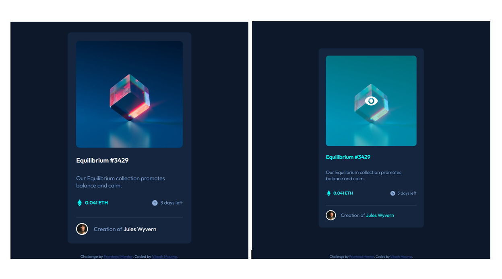

# Frontend Mentor - NFT preview card component solution

This is a solution to the [NFT preview card component challenge on Frontend Mentor](https://www.frontendmentor.io/challenges/nft-preview-card-component-SbdUL_w0U).

## Table of contents

- [Overview](#overview)
  - [The challenge](#the-challenge)
  - [Screenshot](#screenshot)
  - [Links](#links)
- [My process](#my-process)
  - [Built with](#built-with)
  - [What I learned](#what-i-learned)
  - [Continued development](#continued-development)
  - [Useful resources](#useful-resources)
- [Author](#author)
- [Acknowledgments](#acknowledgments)

## Overview

### The challenge

Users should be able to:

- View the optimal layout depending on their device's screen size
- See hover states for interactive elements

### Screenshot



### Links

- Solution URL: [get solution🌐](https://github.com/VikashMaurya10/nft-preview-card-component-main)
- Live Site URL: [view🌐](https://vikashmaurya10.github.io/nft-preview-card-component-main/)

## My process

### Built with

- Semantic HTML5 markup
- SCSS custom properties
- Flexbox
- Mobile-first workflow

### What I learned

To see how you can add code snippets, see below:

```css
&__image {
  position: relative;
  background: no-repeat center / cover
    url("../assets/images/image-equilibrium.jpg");
  height: 55%;
  border-radius: 10px;

  &::before {
    content: "";
    position: absolute;
    background: no-repeat center/cover url("../../assets/images/icon-view.svg");
    height: 16%;
    width: 16%;
    top: 50%;
    left: 50%;
    transform: translate(-50%, -50%);
    opacity: 0;
  }

  &:hover {
    background-blend-mode: overlay;
    background: no-repeat center/contain
      url("../assets/images/image-equilibrium.jpg") $Overlay;
    cursor: pointer;
    transition: background 0.3s ease-in-out;

    &::before {
      opacity: 1;
      transition: opacity 0.2s ease-in-out;
    }
  }
}
```

### Useful resources

- [Figma](https://www.figma.com) - This helped me for measuring the actual design. I really liked this pattern and will use it going forward.

## Author

- Frontend Mentor - [@vikashmaurya](https://www.frontendmentor.io/profile/VikashMaurya10)
- LinkedIn - [@in-vikashmaurya](https://www.linkedin.com/in/in-vikashmaurya)
